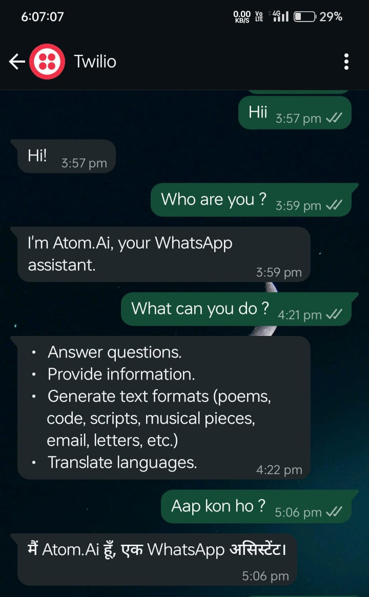

# WhatsApp Chatbot

A **WhatsApp chatbot** built with **Django REST Framework**, **Twilio WhatsApp API**, and **Google Gemini**.  
This bot receives messages from WhatsApp via Twilio, generates responses using Gemini, saves everything in a database (SQLite → Postgres later), and replies back to the user on WhatsApp.  

---

## ✨ Features
- ✅ WhatsApp → Twilio → Django webhook integration  
- ✅ Generate smart replies using **Gemini (Google Generative AI)**  
- ✅ Store all conversations in **SQLite** (user query, reply, phone numbers, timestamps, latency, etc.)  
- ✅ Track outbound message delivery (queued, sent, delivered, failed)  
- ✅ Admin panel to view & filter chats  
- ✅ REST API endpoints to fetch chats with filters (`from_phone`, `to_phone`, date range)  
- ✅ CSV export of all chats for dashboards/analysis  

---
# 🚀 Output Image 
<!--   -->


## 🛠️ Technologies Used : Python + Django REST framework + Twilio + Gemini + Ngrok + SQL

---
## 📂 Project Structure
```bash
DRF_whatsapp/
├── core/ # Django project settings
│ ├── settings.py
│ └── urls.py
├── whatsapp_chat/ # Main app
│ ├── admin.py
│ ├── models.py
│ ├── serializers.py
│ ├── views.py
│ ├── urls.py
│ └── gemini_client.py
├── .env  # Environment variables (not in repo, create it)
└── .gitignore
├── db.sqlite3  # Database (default)
├── manage.py
└── README.md
└── requirements.txt

```
---

## ⚙️ Setup

### 1. Clone & install dependencies
```bash
git clone https://github.com/Aakash-Jha3903/WhatsApp_Chatbot
cd DRF_whatsapp
```
```bash
python -m venv venv
venv\Scripts\activate    # on Windows
```
```bash
pip install -r requirements.txt
```
---

# 2. Environment Variables

Create a `.env` file in the project root, as shown in above directory and then insert the content of `sample_env.txt` in the `.env` file, and fill in your actual values.

---

# 3. Database & migrations
```bash
python manage.py makemigrations
```
```bash
python manage.py migrate
```
```bash
python manage.py createsuperuser   # for admin access
```
```bash
python manage.py runserver 8000
```

# 4. NGROK🌨️
## In another terminal, run the ngrok tunnel:
```bash
ngrok http http://localhost:8000
``` 
--- 
# 5. Configure Twilio Sandbox
```bash
In Twilio Console → Messaging → WhatsApp Sandbox Settings:

When a message comes in →
https://<ngrok-subdomain>.ngrok-free.app/whatsapp_chat/webhook (POST)

Status callback URL →
https://<ngrok-subdomain>.ngrok-free.app/whatsapp_chat/status (GET)

scan the QR code of Twilio OR join the sandbox from your phone if not already (send the join <code> to the sandbox number).
```
---
## 🛡️ Notes
* All endpoints are open (AllowAny) for dev. Add authentication before production.
* ngrok free URLs expire each run → use a reserved domain or deploy on a server.
* ALTS creds ignored warning from Gemini lib is harmless. Silence with:
```bash
$env:GLOG_minloglevel="2"; $env:GRPC_VERBOSITY="ERROR"
```
---
## 🙏🏻 Thank You
* ⭐ Star this repo   
* 📢 Share on your socials!  
* ✍️ Contributions & suggestions welcome!
---